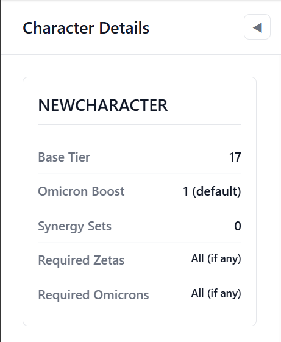
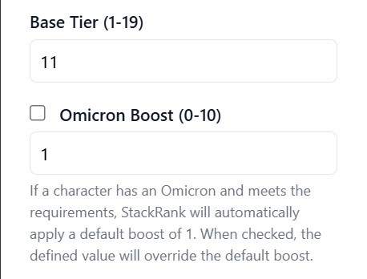
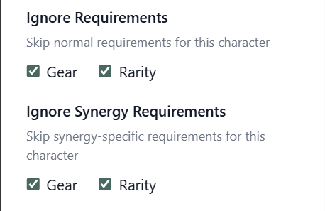
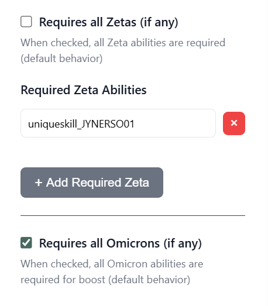
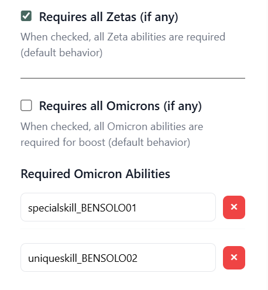

# Character Details

Use the Character Details sidebar to adjust a character’s core details, including  special requirements, exceptions, and set specific ability requirements. Everything on this page updates the currently selected character in the tier grid.

*Figure 1. Character Details sidebar*

## What the Overview Card Tells You

The summary card at the top is read-only. It helps you confirm the state of the character before you start editing:

- **Base Tier** – Shows the tier that is currently saved in `characterBaseData.json` so you can see if your draft will raise or lower the value.
- **Omicron Boost** – Indicates whether the character already has a manual omicron bonus or is relying on the default +1.
- **Synergy Sets** – Displays how many synergy rules are attached so you know whether the character relies on team-specific boosts.
- **Required Zetas** – Summarizes whether all Zetas are mandatory or if only a subset is required.
- **Required Omcrons** – Summarizes whether all Omicrons are mandatory or if only a subset is required.

## Editing the Base Tier

*Figure 2. Character Details sidebar placeholder – replace with a real capture when available.*

1. Enter a value between **1** (top tier) and **19** (lowest tier).
2. Use the up/down controls or type directly; the editor will highlight the field if you leave the allowed range.
3. Compare the draft value to the “Current Tier” badge in the Overview card to double-check the change before saving.

Tips:

- The Base Tier is intended to represent the base value of the character, such as how useful a character is across the entire roster without considering any specific squads. Characters that are singlularly powerful, and lend themselves to being plug-and-play within multiple squads are candidates for higher base tiers. Beyond Galactic Legends, some examples of high Base Tier characters are Darth Bane, Starkiller, and Darth Vader. Some examples of low Base Tier are CUP, Ugnaught, and Imgundi.
- Use comments in your pull request to explain major tier swings so reviewers understand the reasoning.
- If you are experimenting, leave the field but avoid saving until you are confident; the dirty-state banner will remind you that the draft differs from the stored data.

## Omicron Boost

By default, the StackRank service will automatically apply a +1 tier boost whenever a character has the required Omicrons applied. Toggle **“Omicron Boost”** when the character's Omicrons are significant enough that they warrant a greater boost, or you want the character's Omicron boost to be represented in the Visual Editor when selecting "Incude Omiron Boosts"

1. Check the box to enable the numeric field.
2. Enter the bonus (0–10). Use higher values only when the omicron radically changes the character’s viability.
3. Uncheck the box to fall back to the default behavior.

Remember that omicron-only synergy boosts configured on the [Synergy Sets](synergy-sets.md) page still require the character to own the omicron ability in-game.

## Ignoring Requirements

*Figure 3. Example showing Ignoring Requirements for Gear and Rarity and Ignoring Synergy Requirements for Gear and Rarity*

Some characters usefulness does not require that the character meet specific rarity and gear levels. Use the two “Ignore Requirements” sections to  waive those checks:

- **Character requirements** – Skip the usual gear or rarity requirements for the character itself. This prevents rarity and gear-level scoring penalties.
- **Synergy requirements** – Skip requirements that would normally apply to teammates specified in synergy sets. This allows low-gear or low-rarity characters to participate in synergy.

Examples: Iden Versio and Wat Tambor, both are highly useful at low rarity and low gear levels.

Check the boxes that make sense for your scenario, then describe the exception in your PR so reviewers know why the character is being graded without those constraints. Leave everything unchecked to keep the standard StackRank rules.

## Tracking Required Abilities

*Figure 4. Example showing all abilities required*

### When All Abilities Are Mandatory

- Leave the **“Requires all Zetas (if any)”** checkbox turned on when every zeta the character has must be applied for the tier to hold.
- Do the same for **omicrons** if the kit needs every omicron to be maximally useful.

### When Only Specific Abilities Are Needed

*Figure 5. Example of specifically required Zetas*

*Figure 6. Example of specifically required Omicrons*

1. Clear the checkbox. An "Add Required Zeta/Omicron" button will appear.
2. Add the ability IDs that should be mandatory. The values must specifically match the ability ID. A list helper will be implemented to assist with entering the values.
3. Remove entries by clicking the red X icon.

Leaving the list empty after unchecking the box communicates that none of the abilities are required (even though the character has them available).

## Saving Your Changes

- The **Update Character** button activates once at least one field changes. If it stays disabled, revisit the sections above until something in the draft differs from the saved data.
- When you select **Update Character**, the editor checks every field for mistakes (range violations, duplicate ability IDs, conflicting requirement settings). Fix any highlighted issues and try again.
- A green “Saved” badge appears near the toolbar after a successful update. If you see “Invalid Draft” or “Unsaved Draft,” head over to the [Draft & Validation](draft-validation.md) page for troubleshooting tips.

Use this panel whenever you need to adjust core ranking information before diving into team-specific logic on the Synergy Sets tab.
