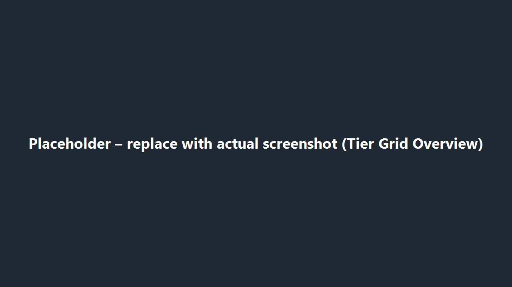
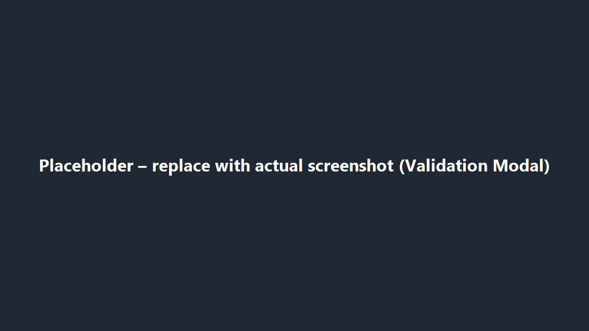

# Draft & Validation Workflow

The Visual Editor keeps your changes in an in-browser draft until you click **Update Character**. Use this page to understand what each status message means and how to recover if validation fails.

*Figure 1. Placeholder for the tier grid overview – replace with the actual UI once screenshots are available.*

## Follow a Draft From Start to Finish

1. **Pick a character** in the tier grid. The editor loads its current data into a draft copy.
2. **Make edits** on the Character Details and Synergy Sets tabs. Every change updates the draft instantly, but nothing is written to disk yet.
3. **Watch the status badge** in the toolbar:
   - Yellow “Unsaved Draft” = you have local changes.
   - Red “Invalid Draft” = something is wrong and must be fixed before saving.
   - Green “Saved” = the draft matches the file on disk.
4. **Switching characters?** If you try to leave with unsaved work, a dialog appears offering to save, discard, or stay on the current character.
5. **Save** by selecting **Update Character** once you are satisfied.

## What Happens When You Save

*Figure 2. Placeholder for the validation modal – capture the real dialog when available.*

1. The editor checks every field for obvious mistakes (tier outside 1–19, too many synergy slots, duplicate character IDs, etc.). Invalid fields turn red with helper text explaining the fix.
2. If any blocking issues remain, the **Validation Issues** modal lists them so you can jump directly to the problem area.
3. After the UI checks pass, the editor runs one more schema validation pass to ensure the JSON you are about to save is well-formed.
4. Only when both layers succeed does the character update in the grid and the badge flip back to green.

## Handling Validation Errors

- **Red inputs** – hover or focus the field to read the full message. Most issues resolve by correcting the value and trying again.
- **Slot limit errors** – reduce the number of teammates or lower the “matches required” values until the counter shows four or fewer total slots.
- **Ability ID errors** – double-check the exact casing used in game files. Copying from another entry is the fastest way to avoid typos.
- **Modal list** – use the “Focus” link next to each issue to jump straight to the offending control.

## Discarding or Resetting

- Select **Discard Draft** (next to the save button) to revert every field back to the last saved values. This also clears any validation warnings.
- When the unsaved-changes dialog appears, choose **Discard** to accomplish the same reset without leaving the page.

## Persistence Tips

- There is **no autosave**. Refreshing the browser or closing the tab discards your draft immediately.
- Save frequently when experimenting with multiple synergy rules. It is easier to undo one saved change via git than to rebuild a complex draft from scratch.

## After You Save

1. Confirm the tier grid reflects your expected numbers and tag counts.
2. If you are done editing characters for now, run `Tools/ValidateCharacterData.ps1` to ensure repository-wide rules still pass.
3. Reopen the Visual Editor if the PowerShell script finds issues; the inline validation hints should mirror the CLI output so you can resolve them quickly.
4. Commit once both the in-browser save and the script succeed.
