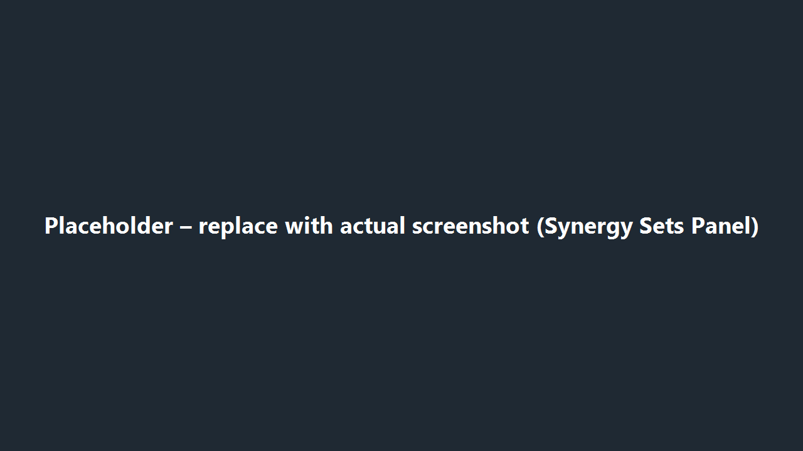
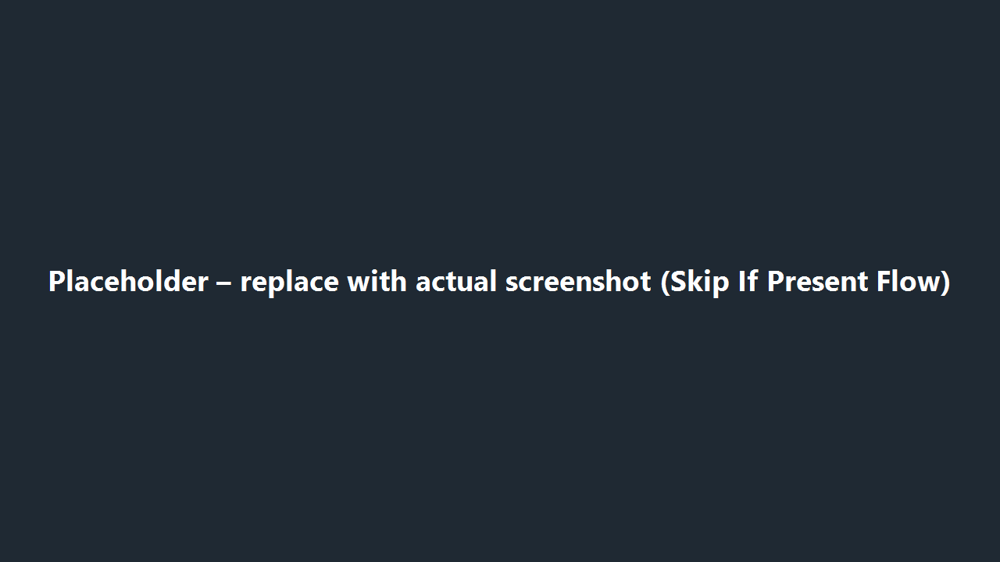

# Synergy Sets

Use the Synergy Sets tab to describe how a character’s tier changes when certain teammates or squad compositions are present. Each set represents one “if this team is built, then improve the tier by X” rule.

*Figure 1. Synergy Set editor placeholder – swap in a real capture once available.*

## Understand the Grid

- Every accordion row is one synergy rule. Expand the row to edit it.
- The chips in the header tell you at a glance how many points the synergy adds, how many specific characters it names, and whether any skip conditions exist.
- Red highlights or warning icons signal a rule that cannot be saved yet (missing boost, too many slots used, or invalid character names).

## Add a New Synergy

1. Select **Add Synergy Set**. A new, empty rule appears at the bottom of the list.
2. Set at least one of the two boost sliders:
   - **Tier Boost** – Applies whenever the rule matches, regardless of omicrons.
   - **Omicron Boost** – Extra bonus that only applies when the character owns the relevant omicron.
3. Describe the required teammates using either named characters or category blocks (detailed below).
4. Optionally specify characters that cancel the bonus via **Skip If Present**.
5. Capture any requirement caveats (specific zetas/omicrons) and jot a short note for reviewers explaining the intent.

## Managing Character Slots

- Start typing a character ID and pick from the autosuggest list so you always reference an existing unit.
- You can spend at most **four slots** per synergy rule. Explicit characters each cost one slot, and category blocks consume slots equal to their “matches required” value.
- The slot counter beneath the list updates as you add teammates. Stay at four or fewer to avoid validation errors.

## Using Category Blocks

*Figure 2. Placeholder for category + skip logic diagram – replace when a real screenshot exists.*

Category blocks let you describe flexible lineups without listing every character:

- **Include Tags** – Type the faction/role tags you want (e.g., `Sith`, `Empire`, `BountyHunter`). At least one tag is required.
- **Exclude Tags** – Optional. Use this to prevent unwanted overlaps (e.g., include `Empire`, exclude `Inquisitor`).
- **Matches Required** – Choose how many teammates must satisfy the include/exclude criteria. This number also counts toward the four-slot limit.

If the combination you enter would be impossible (no include tags, too many matches, etc.), the editor calls it out immediately so you can adjust before saving.

## Skip-If-Present

Use this list to specify teammates that turn off the bonus. For example, you might state that a Rebel synergy should not apply if `BADBATCHOMEGA` sneaks into the squad. The field works like the main character picker: autosuggest, duplicate prevention, and validation against known IDs.

## Per-Synergy Ability Requirements

Sometimes a synergy only works if another character has a specific zeta or omicron. Expand the **Ability Requirements** section inside the rule to capture that nuance. You can:

- Require all zetas/omicrons that the teammate owns, or
- List particular ability IDs if only a subset matters.

Keep the reasoning in the Notes field so reviewers can follow your assumptions.

## Editing Existing Rules

- **Reorder**: Use the ⋮ menu to move a rule up or down. The tier grid preview refreshes instantly.
- **Duplicate** (if enabled in your build): quickly copy a rule when only minor tweaks are needed.
- **Delete**: Removes the rule after a confirmation prompt. This cannot be undone once you save the character.

## Save Checklist

Before the **Update Character** button accepts your work, make sure each rule:

- Has a non-zero tier or omicron boost between 0 and 10.
- Uses no more than four total slots (characters plus category matches).
- References only valid character IDs.
- Includes at least one tag per category block.
- Lists ability requirements only when you truly intend to gate the synergy.

If something still refuses to save, open the [Draft & Validation](draft-validation.md) page to see how the app reports errors and how to resolve them.
